# Sistema de Material de Construção

Este repositório contém o código‑fonte e os artefatos de projeto de um **sistema de material de construção**.  O objetivo é demonstrar como implementar e interagir com um banco de dados PostgreSQL a partir de uma aplicação Java com interface de linha de comando (CLI).

---

## Sumário

1. [Requisitos Funcionais](#requisitos-funcionais)
5. [Aplicação Java Swing](#aplicação-java-cli)
6. [Como Executar](#como-executar)
7. [Autor](#autor)

---

## Requisitos Funcionais

> Adaptado do enunciado do trabalho.

Considerando o sistema de software de um sistema de material de construção da 1ª avaliação, então conceba, modele e implemente uma IHM (Interface Homem-Máquina) do tipo Desktop empregando Swing que permita buscar, inserir, atualizar e remover registros no banco de dados via JDBC e o driver para PostgreSQL. O software deve ter as seguintes partes básicas em desktop (Swing): tela de apresentação (splash), tela de login, menu principal que permite inserir, remover, atualizar e apagar dados.  Proponha as demais janelas e campos em Swing que permitam fazer a interação com o usuário. As funcionalidades de manipulação (buscar, inserir, atualizar e remover registros) com o banco de dados devem estar funcionando.

---

## Aplicação Java Swing

| Sub‑pacote | Responsabilidade                            |
| ---------- | ------------------------------------------- |
| `entity`   | Classes que mapeiam as tabelas              |
| `dao`      | Operações JDBC (CRUD)                       |
| `viewwindow`     | Telas e menus em CLI                        |
| `util`     | Utilidades de entrada, conexão e formatação |

### Fluxo de Uso

1. **Tela de Apresentação** – janela com logo e nome da empresa.

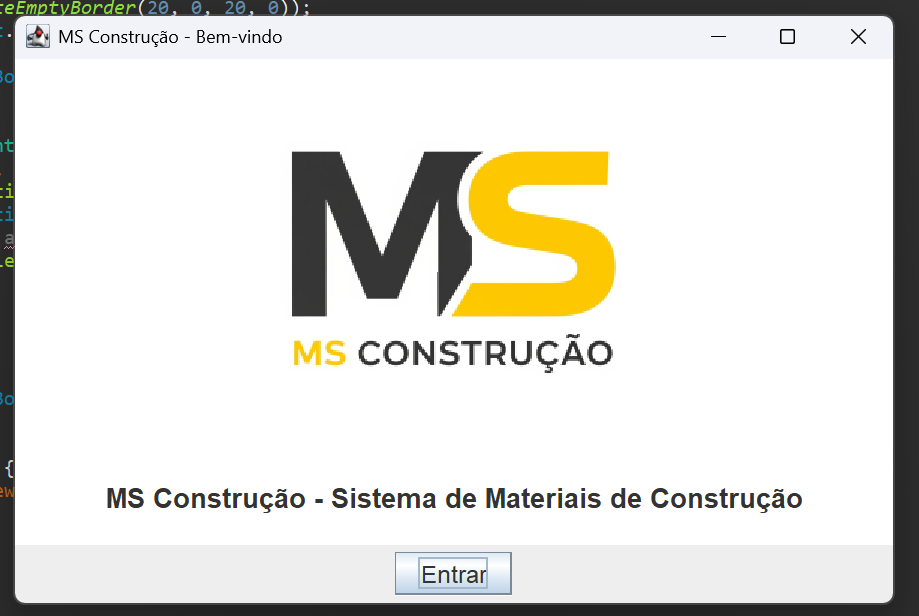

2. **Tela de Login** – autenticação de usuário (`usuario`/`senha`).

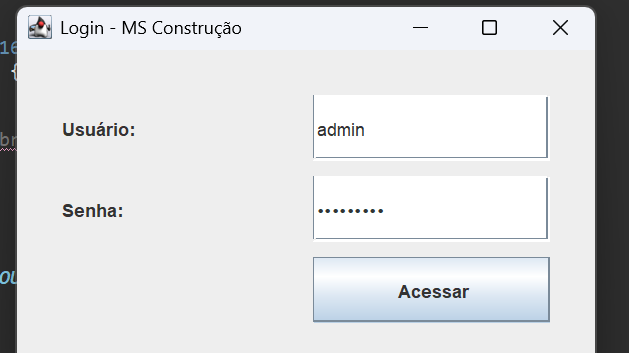

Tela de criação de usuario

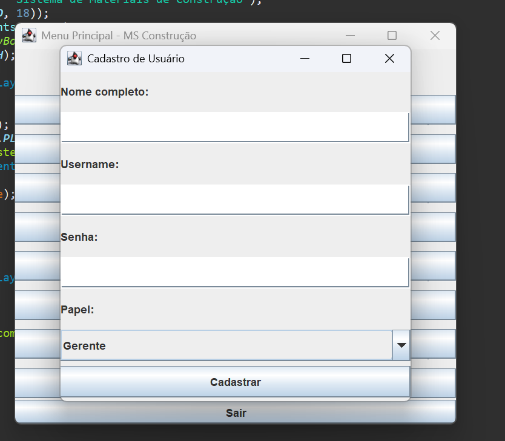

3. **Menu Principal** – opções para Gerente, Vendedor, Comprador ou Caixa.

| Papel | Funcionalidades Principais                            |
| ---------- | ------------------------------------------- |
| `Caixa`   | Gerenciar vendas              |
| `Gerente`      | Gerenciar todos os módulos e usuários                   |
| `Comprador`     | Consultar produtos e vendas              |
| `Vendedor`     |Cadastrar e gerenciar compradores e vendas|

<h3 align="center">Menus por Papel</h3>

<table align="center">
  <tr>
    <td align="center">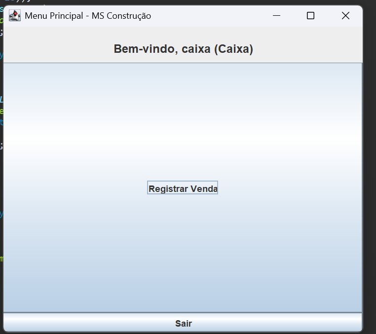<br/>Caixa</td>
    <td align="center">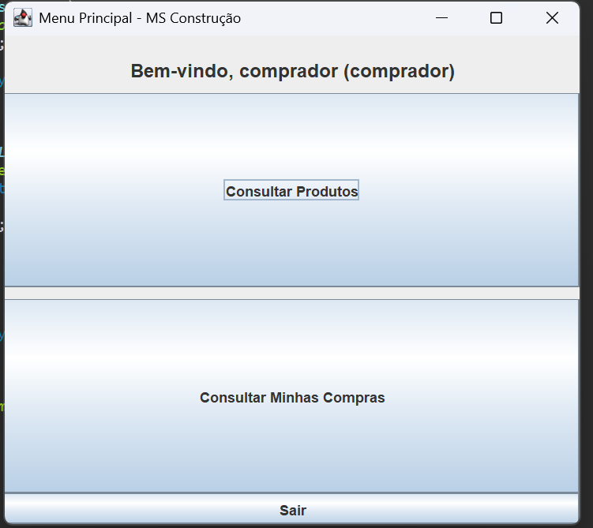<br/>Comprador</td>
  </tr>
  <tr>
    <td align="center">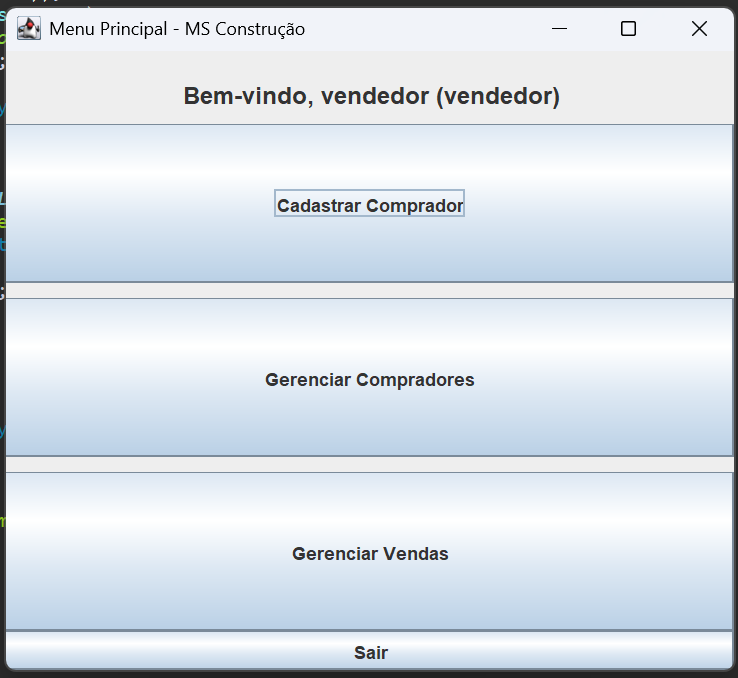<br/>Vendedor</td>
    <td align="center">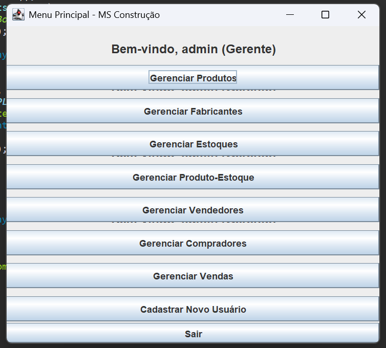<br/>Gerente</td>
  </tr>
</table>    

---


# Fluxo de telas do produtos

 
<h3 align="center">Menus produto</h3>
<table align="center">
  <tr>
    <td align="center">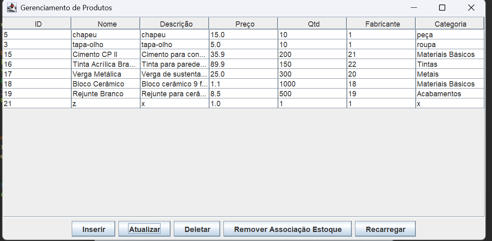<br/>Tela do produto</td>
    <td align="center">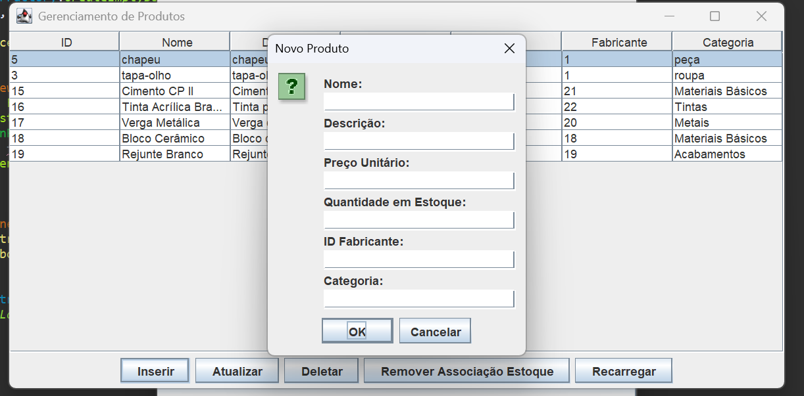<br/>Novo produto</td>
  </tr>
  <tr>
    <td align="center">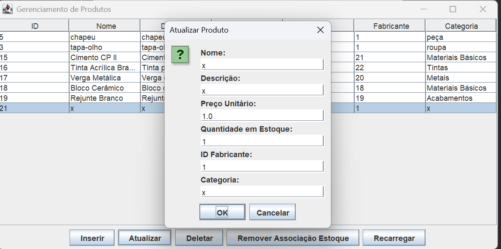<br/>Atualizar produto</td>
    <td align="center">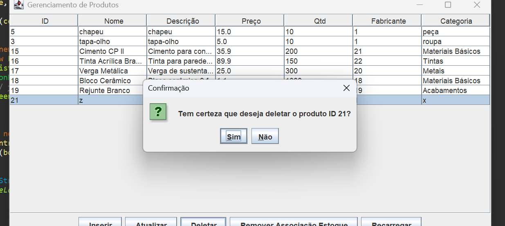<br/>Deletar produto</td>
  </tr>
</table>  

As demais funcionalidades para fabricante, vendedor e comprador são semelhantes a esta tela, com exceção da tela de produto para o comprador, na qual as funções dos outros papéis estão desativadas.


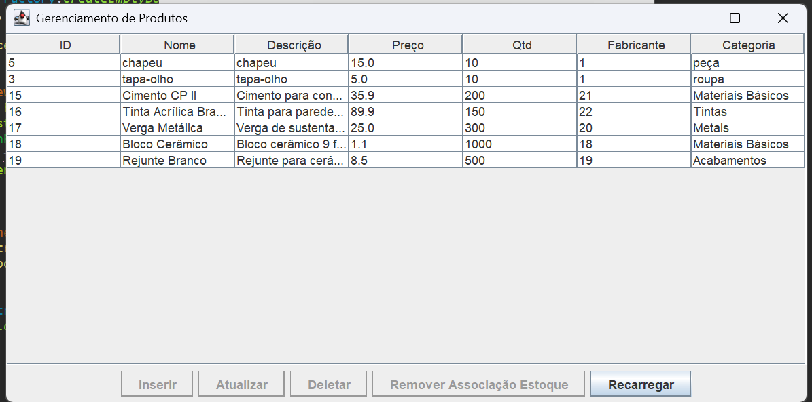 


<h3 align="center">Menus produtoestoque</h3>
<table align="center">
  <tr>
    <td align="center">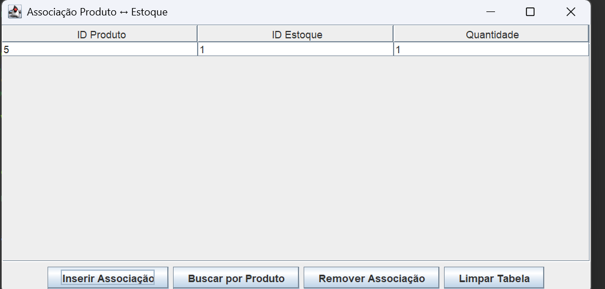<br/>Tela do Associacao produto estoque</td>
    <td align="center">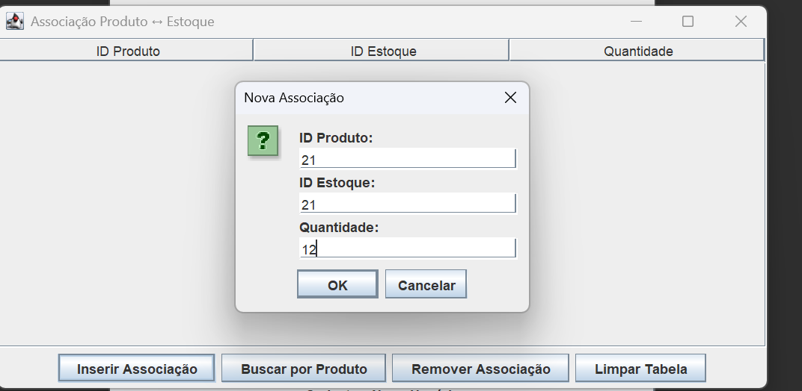<br/>Novo Associacao</td>
  </tr>
  <tr>
    <td align="center">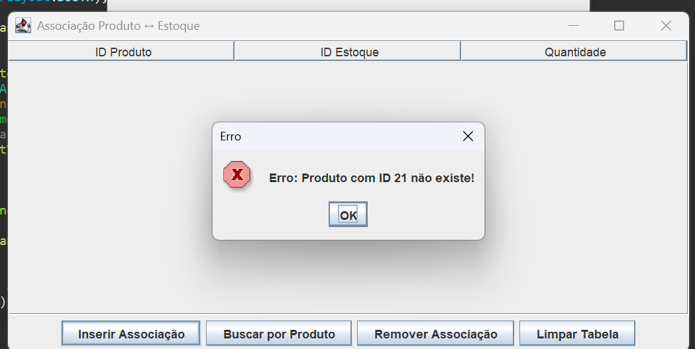<br/>Quando o id do produto não existe</td>
    <td align="center">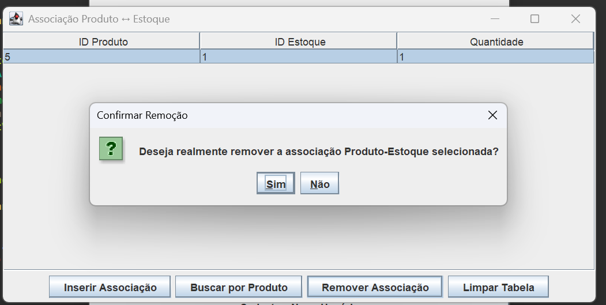<br/>Deletar produto</td>
  </tr>
</table>  


<h3 align="center">Menus venda</h3>
<table align="center">
  <tr>
    <td align="center">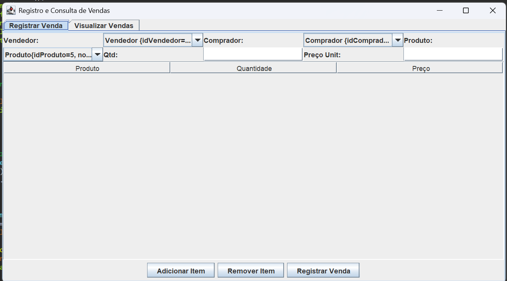<br/>Tela da venda</td>
    <td align="center">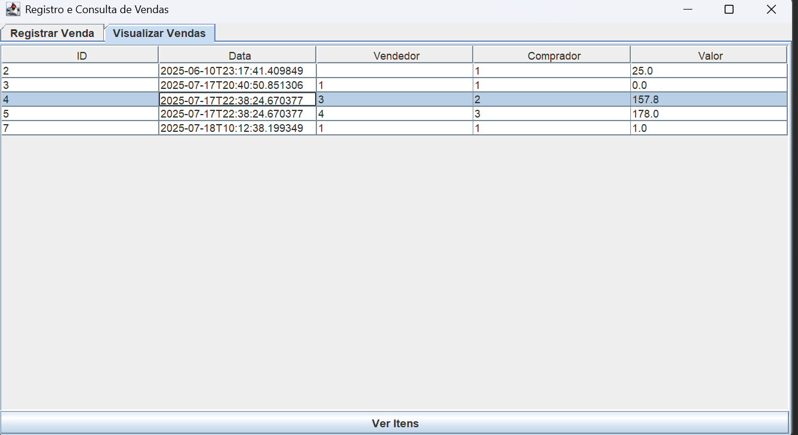<br/>visualizar</td>
  </tr>
  <tr>
    <td align="center">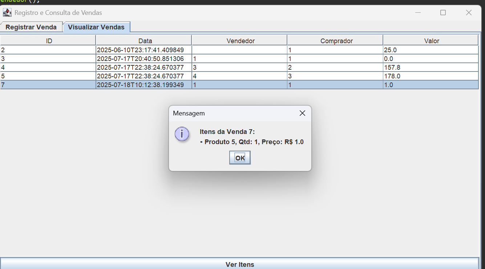<br/>Ver itens da venda</td>
  </tr>
</table>  
## Como Executar

```bash
# 1. Suba o PostgreSQL (ex.: via Docker Compose)
# 2. Configure as variáveis de ambiente DB_HOST, DB_PORT, DB_DATABASE, DB_USER, DB_PASS
# 3. Compile o projeto Java
mvn clean package
# 4. Execute o jar
java -jar target/materialsystem-1.0-SNAPSHOT.jar
```

---

## Autor

* **Carlos Mendes**  

> © 2025 — Licença MIT. Sinta‑se livre para usar, modificar e contribuir.