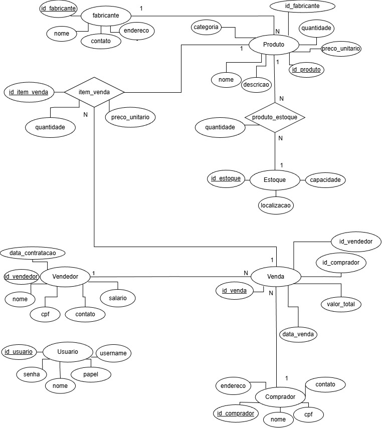
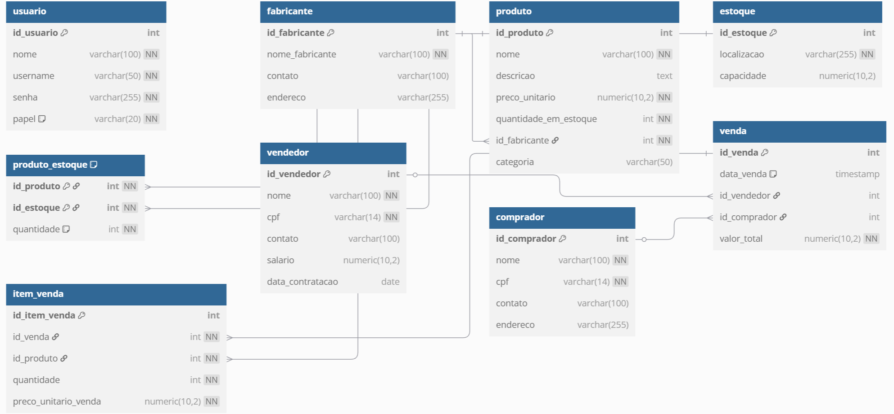
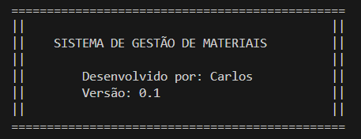
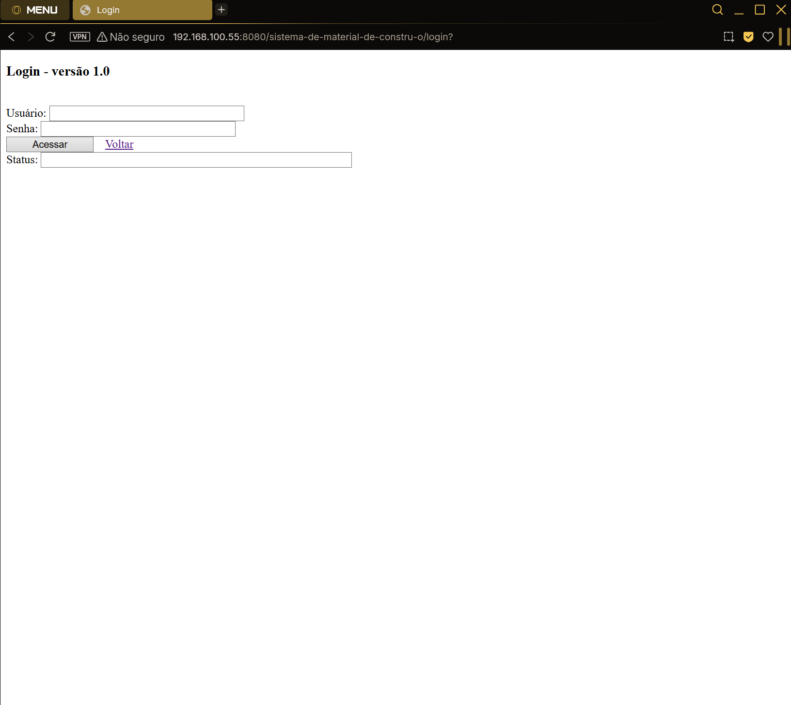
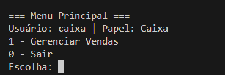
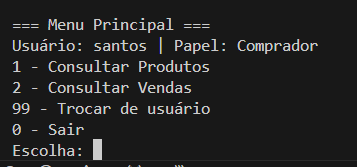
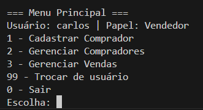
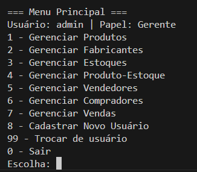

# Sistema de Material de Construção

Este repositório contém o código‑fonte e os artefatos de projeto de um **sistema de material de construção**.  O objetivo é demonstrar como implementar e interagir com um banco de dados PostgreSQL a partir de uma aplicação Java com interface de linha de comando (CLI).

---

## Sumário

1. [Requisitos Funcionais](#requisitos-funcionais)
2. [Entidades e Atributos](#entidades-e-atributos)
3. [Modelo Entidade‑Relacionamento (MER)](#modelo-entidade-relacionamento-mer)
3. [Modelo Entidade‑Relacionamento (MR)](#modelo-relacional)
4. [Esquema Relacional (PostgreSQL)](#esquema-relacional-postgresql)
5. [Aplicação Java (CLI)](#aplicação-java-cli)
6. [Como Executar](#como-executar)
7. [Autor](#autor)

---

## Requisitos Funcionais

> Adaptado do enunciado do trabalho.

* **a.** O sistema deve conter as entidades **Estoque**, **Produto**, **Fabricante**, **Vendedor** e **Comprador**.
* **b.** Cada entidade possui atributos específicos e está vinculada a papéis de **Gerente**, **Vendedor**, **Comprador** e **Caixa**.
* **c.** O modelo ER proposto deve representar todas as relações necessárias.
* **d.** O banco de dados deve ser criado em **PostgreSQL**.
* **e.** Devem existir operações *CRUD* completas em SQL.
* **f.** A interface CLI em Java (via **JDBC**) deve permitir que o usuário execute todas as operações de maneira intuitiva.

---

## Entidades e Atributos

| Entidade       | Atributos Principais                                                                                             | Observações          |
| -------------- | ---------------------------------------------------------------------------------------------------------------- | -------------------- |
| **Estoque**    | `id_estoque PK`, `localizacao`, `capacidade`                                                                     |                      |
| **Produto**    | `id_produto PK`, `nome`, `descricao`, `preco_unitario`, `quantidade_em_estoque`, `id_fabricante FK`, `categoria` |                      |
| **Fabricante** | `id_fabricante PK`, `nome_fabricante`, `contato`, `endereco`                                                     |                      |
| **Vendedor**   | `id_vendedor PK`, `nome`, `cpf`, `contato`, `salario`, `data_contratacao`                                        |                      |
| **Comprador**  | `id_comprador PK`, `nome`, `cpf`, `contato`, `endereco`                                                          |                      |
| **Venda**      | `id_venda PK`, `data_venda`, `id_vendedor FK`, `id_comprador FK`, `valor_total`                                  |                      |
| **ItemVenda**  | `id_item_venda PK`, `id_venda FK`, `id_produto FK`, `quantidade`, `preco_unitario_venda`                         | Tabela de associação |
| **ProdutoEstoque**  | `id_produto PK`, `id_estoque FK`, `quantidade`| Tabela de associação |

---

## Modelo Entidade‑Relacionamento (MER)




---

## Modelo Relacional (MR)

A figura a seguir apresenta o diagrama ER construído no **dbdiagram.io**.



> **Legenda**
> • PK — Primary Key
> • FK — Foreign Key
> • (1) — Cardinalidade 1
> • (N) — Cardinalidade Muitos

---
## Esquema Relacional (PostgreSQL)

Os comandos SQL abaixo criam as tabelas com restrições de integridade referencial:

```sql
CREATE TABLE IF NOT EXISTS Usuario (
    id_usuario SERIAL PRIMARY KEY,
    nome VARCHAR(100) NOT NULL,
    username VARCHAR(50) UNIQUE NOT NULL,
    senha VARCHAR(255) NOT NULL,
    papel VARCHAR(20) NOT NULL CHECK (papel IN ('Gerente', 'Vendedor', 'Comprador', 'gerente', 'vendedor', 'comprador','Caixa', 'caixa'))

);

CREATE TABLE IF NOT EXISTS Fabricante (
    id_fabricante SERIAL PRIMARY KEY,
    nome_fabricante VARCHAR(100) UNIQUE NOT NULL,
    contato VARCHAR(100),
    endereco VARCHAR(255)
);

CREATE TABLE IF NOT EXISTS Produto (
    id_produto SERIAL PRIMARY KEY,
    nome VARCHAR(100) NOT NULL,
    descricao TEXT,
    preco_unitario NUMERIC(10, 2) NOT NULL,
    quantidade_em_estoque INTEGER NOT NULL,
    id_fabricante INTEGER NOT NULL REFERENCES Fabricante(id_fabricante),
    categoria VARCHAR(50)
);

CREATE TABLE IF NOT EXISTS Estoque (
    id_estoque SERIAL PRIMARY KEY,
    localizacao VARCHAR(255) UNIQUE NOT NULL,
    capacidade NUMERIC(10, 2)
);

CREATE TABLE IF NOT EXISTS ProdutoEstoque (
    id_produto INTEGER NOT NULL REFERENCES Produto(id_produto),
    id_estoque INTEGER NOT NULL REFERENCES Estoque(id_estoque),
    quantidade INTEGER NOT NULL CHECK (quantidade >= 0),
    PRIMARY KEY (id_produto, id_estoque),
    FOREIGN KEY (id_produto) REFERENCES Produto(id_produto)
        ON UPDATE CASCADE
        ON DELETE CASCADE,
    FOREIGN KEY (id_estoque) REFERENCES Estoque(id_estoque)
        ON UPDATE CASCADE
        ON DELETE CASCADE
);

CREATE TABLE  IF NOT EXISTS Vendedor (
    id_vendedor SERIAL PRIMARY KEY,
    nome VARCHAR(100) NOT NULL,
    cpf VARCHAR(14) UNIQUE NOT NULL,
    contato VARCHAR(100),
    salario NUMERIC(10, 2),
    data_contratacao DATE
);

CREATE TABLE IF NOT EXISTS Comprador (
    id_comprador SERIAL PRIMARY KEY,
    nome VARCHAR(100) NOT NULL,
    cpf VARCHAR(14) UNIQUE NOT NULL,
    contato VARCHAR(100),
    endereco VARCHAR(255)
);

CREATE TABLE IF NOT EXISTS Venda (
    id_venda SERIAL PRIMARY KEY,
    data_venda TIMESTAMP DEFAULT CURRENT_TIMESTAMP,
    id_vendedor INTEGER REFERENCES Vendedor(id_vendedor),
    id_comprador INTEGER REFERENCES Comprador(id_comprador),
    valor_total NUMERIC(10, 2) NOT NULL
);

CREATE TABLE IF NOT EXISTS ItemVenda (
    id_item_venda SERIAL PRIMARY KEY,
    id_venda INTEGER NOT NULL REFERENCES Venda(id_venda),
    id_produto INTEGER NOT NULL REFERENCES Produto(id_produto),
    quantidade INTEGER NOT NULL,
    preco_unitario_venda NUMERIC(10, 2) NOT NULL
);
```
## Operações SQL CRUD

Os exemplos abaixo ilustram comandos aplicados à entidade `Fabricante`.

```sql
-- CREATE
INSERT INTO Fabricante (nome_fabricante, contato, endereco)
VALUES (?, ?, ?);

-- READ
SELECT * FROM Fabricante WHERE id_fabricante = ?;

-- UPDATE
UPDATE Fabricante
SET nome_fabricante = ?, contato = ?, endereco = ?
WHERE id_fabricante = ?;

-- DELETE
DELETE FROM Fabricante WHERE id_fabricante = ?;
```

Esses comandos são utilizados dentro dos métodos Java do pacote `dao/`, garantindo a separação da lógica de negócios e persistência.

> 📂 Para consultar os arquivos completos, acesse a pasta [`dao/`](dao/):


## Aplicação Java CLI

| Sub‑pacote | Responsabilidade                            |
| ---------- | ------------------------------------------- |
| `entity`   | Classes que mapeiam as tabelas              |
| `dao`      | Operações JDBC (CRUD)                       |
| `view`     | Telas e menus em CLI                        |
| `util`     | Utilidades de entrada, conexão e formatação |

### Fluxo de Uso

1. **Tela de Apresentação** – banner ASCII com nome e versão do sistema.

2. **Tela de Login** – autenticação de usuário (`usuario`/`senha`).

3. **Menu Principal** – opções para Gerente, Vendedor, Comprador ou Caixa.

| Papel | Funcionalidades Principais                            |
| ---------- | ------------------------------------------- |
| `Caixa`   | Gerenciar vendas              |
| `Gerente`      | Gerenciar todos os módulos e usuários                   |
| `Comprador`     | Consultar produtos e vendas              |
| `Vendedor`     |Cadastrar e gerenciar compradores e vendas|

<h3 align="center">Menus por Papel</h3>

<table align="center">
  <tr>
    <td align="center"><br/>Caixa</td>
    <td align="center"><br/>Comprador</td>
  </tr>
  <tr>
    <td align="center"><br/>Vendedor</td>
    <td align="center"><br/>Gerente</td>
  </tr>
</table>    

---

## Como Executar

```bash
# 1. Suba o PostgreSQL (ex.: via Docker Compose)
# 2. Configure as variáveis de ambiente DB_HOST, DB_PORT, DB_DATABASE, DB_USER, DB_PASS
# 3. Compile o projeto Java
mvn clean package
# 4. Execute o jar
java -jar target/materialsystem-1.0-SNAPSHOT.jar
```

---

## Autor

* **Carlos Mendes**  

> © 2025 — Licença MIT. Sinta‑se livre para usar, modificar e contribuir.