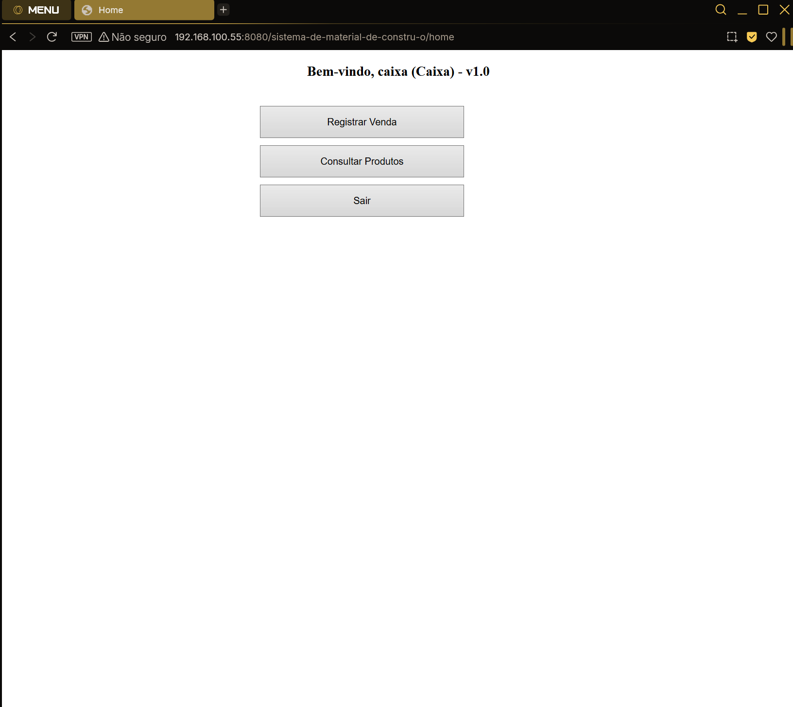

# Sistema de Material de Construção — Versão Web (Servlet/JDBC)

Este repositório contém o código-fonte e os artefatos de um **sistema de material de construção**.
O objetivo é demonstrar como implementar uma **IHM Web** em **Java Servlet** (sem Maven/JSP, por restrição do projeto) com **JDBC + PostgreSQL**, contemplando: **tela de apresentação (splash)**, **tela de login**, **menu principal** e páginas com **buscar, inserir, atualizar, remover**.

> **Banco**: PostgreSQL • **Driver**: `postgresql-*.jar` • **Servidor**: Apache Tomcat 10 • **Auth**: jBCrypt

---

## Sumário

1. [Requisitos Funcionais](#requisitos-funcionais)
2. [Arquitetura e Pacotes](#arquitetura-e-pacotes)
3. [Telas](#telas)
4. [RBAC — Papéis e Permissões](#rbac--papéis-e-permissões)
5. [Módulos CRUD](#módulos-crud)
6. [Rotas Web](#rotas-web)
7. [Como Executar](#como-executar)
8. [Acesso pela Rede Local](#acesso-pela-rede-local)
9. [Autor](#autor)

---

## Requisitos Funcionais

> Adaptado do enunciado:

Conceber, modelar e implementar uma **IHM Web** que permita **buscar, inserir, atualizar e remover** registros no banco via **JDBC** (driver PostgreSQL).  
O software deve possuir: **tela de apresentação (splash)**, **tela de login**, **menu principal** com as operações de dados, além das demais janelas necessárias.  
Todas as funcionalidades de manipulação (**CRUD**) devem estar **funcionando**.

---

## Arquitetura e Pacotes

| Pacote                     | Responsabilidade                                |
|---------------------------|--------------------------------------------------|
| `com.materialsystem.entity` | Entidades (mapeiam as tabelas)                  |
| `com.materialsystem.dao`    | JDBC/SQL (CRUD)                                 |
| `com.materialsystem.web`    | Servlets (HTML com `PrintWriter`)               |
| `com.materialsystem.util`   | Conexão DB, utilitários, `Roles`, `PasswordUtils` |

---

## Telas

### 1) Splash (apresentação)

### 2) Login

### 3) Menu principal (por papel)

<table>
  <tr>
    <td align="center"> Caixa</td>
    <td align="center"> Comprador</td>
  </tr>
  <tr>
    <td align="center"> Vendedor</td>
    <td align="center"> Gerente</td>
  </tr>
</table>

---

## RBAC — Papéis e Permissões

| Papel       | Permissões principais (resumo)                                                                 |
|-------------|-------------------------------------------------------------------------------------------------|
| **Gerente** | CRUD completo em todos os módulos (Produto, Fabricante, Estoque, Produto-Estoque, Vendedor, Comprador, Venda, Usuário). |
| **Vendedor**| Gerenciar **Compradores** e **Vendas**; pode **cadastrar Usuário** apenas do tipo **Comprador**. |
| **Caixa**   | **Registrar/Visualizar Vendas**; pode consultar Produtos.                                      |
| **Comprador** | **Consultar Produtos** e **minhas** Vendas; botões de edição ficam **desativados**.            |

A autorização é aplicada em duas camadas:  
1) **Filtro** (`AuthFilter`) bloqueia rotas por papel;  
2) **Servlets** aplicam checagens por **ação** (ex.: Comprador não pode inserir produto).

---

## Módulos CRUD

### Usuários
- Gerente: CRUD completo.  
- Vendedor: **somente Inserir** e **apenas** papel **Comprador**.
  

### Produtos
CRUD completo (Gerente). Para os demais papéis, edição **desativada**.

<table>
  <tr>
    <td align="center"> Tela principal</td>
    <td align="center"> Inserir</td>
  </tr>
  <tr>
    <td align="center"> Localizar</td>
    <td align="center"> Relatório</td>
  </tr>
  <tr>
    <td align="center"> Exclusão</td>
  </tr>
</table>

### Fabricantes / Estoques / Produto-Estoque / Vendedores / Compradores

<table>
  <tr>
    <td align="center"> Fabricante</td>
    <td align="center"> Estoque</td>
  </tr>
  <tr>
    <td align="center"> Produto-Estoque</td>
    <td align="center"> Vendedor</td>
  </tr>
  <tr>
    <td align="center"> Comprador</td>
  </tr>
</table>

### Vendas
- Gerente/Vendedor/Caixa: podem **registrar** e **listar** vendas;  
- **Excluir**: Gerente/Vendedor;  
- Comprador: **lista apenas as próprias** e pode ver itens da venda.

---

## Rotas Web

| Rota                  | Descrição                           |
|-----------------------|-------------------------------------|
| `/welcome`            | Splash                              |
| `/login`              | Login                               |
| `/home`               | Menu principal (varia por papel)    |
| `/usuario`            | Cadastro de usuários (RBAC aplicado)|
| `/produto`            | Produtos                            |
| `/fabricante`         | Fabricantes                         |
| `/estoque`            | Estoques                            |
| `/produtoestoque`     | Associação Produto-Estoque          |
| `/vendedor`           | Vendedores                          |
| `/comprador`          | Compradores                         |
| `/venda`              | Vendas                              |

---

## Como Executar

1. **Copiar JARs para o webapp**  
   Coloque em `WEB-INF/lib/` do seu contexto:
   - `postgresql-42.x.x.jar`
   - `jbcrypt-0.4.jar`

2. **Configurar conexão**  
   Ajuste `DatabaseConnection.java` (IP/porta/banco/usuário/senha).
